>## **2026.02.13 | Academic Seminar**

E2E with Diffusion Model Planning

### **Full Presentation**

<iframe src="https://view.officeapps.live.com/op/embed.aspx?src=https://ysh-research.github.io/Presentations/assets/2026-02-13/2026.02.13.pptx" width="750px" height="470px" frameborder="0"></iframe>

### **Introduction**

Title: Improving Diffusion-Based Planning for End-to-End Autonomous Driving

This seminar covers two parallel research tracks. The first is an experimental investigation into Diffusion-Planner, a Transformer-based diffusion model for trajectory planning evaluated on the nuPlan benchmark. We identify critical performance degradation in high-curvature scenarios and propose four concrete solutions. The second track reports engineering progress on integrating End-to-End models into the Autoware platform, including communication with the open-source developer community.

**Section 1: Why Diffusion-Planner?**

Diffusion-Planner was selected for three key reasons. First, it is a practical planning framework that goes beyond simple waypoint generation — it integrates velocity profiles, acceleration, and surrounding vehicle states to produce trajectories directly compatible with LQR controllers. Second, it supports closed-loop evaluation on nuPlan, enabling quantitative comparison between raw model output and rule-based post-processed output. Third, it shares the identical mathematical framework with image generation diffusion models (DALL-E, Stable Diffusion), meaning advances in score-based generative modeling can be directly transferred to motion planning.

=== "Slide 3"
    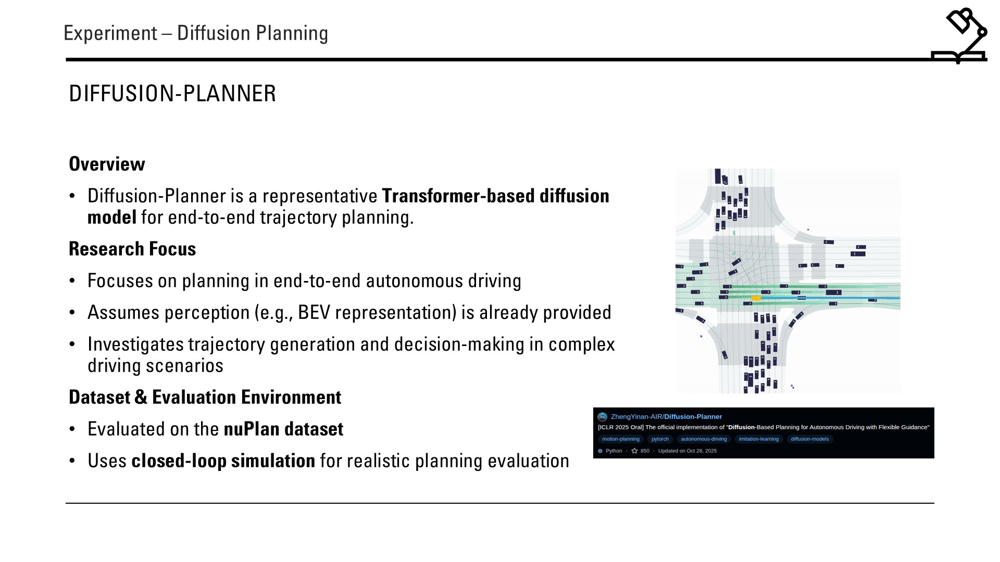

=== "Slide 4"
    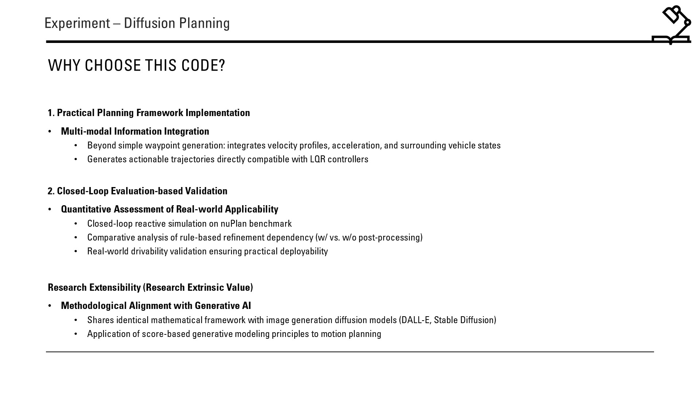

**Section 2: Problem — Performance Degradation in Hard Scenarios**

The nuPlan benchmark reveals a significant performance drop in challenging scenarios. While Diffusion-Planner scores ~89 (NR) / ~82 (R) on standard Val14 and Test14 splits, it drops to 75.99 (NR) / 69.22 (R) on Test14-hard. Root cause analysis points to three issues:

Data Imbalance: The dataset is dominated by straight-driving scenarios, with insufficient high-curvature examples (lane changes, sharp turns).
Inadequate Curvature-Velocity Modeling: Velocity and curvature are treated as independent variables, failing to capture the natural speed-curvature coupling in human driving.
Training Objective Limitations: Behavior cloning cannot learn recovery from mistakes and lacks explicit optimization for safety and comfort constraints.

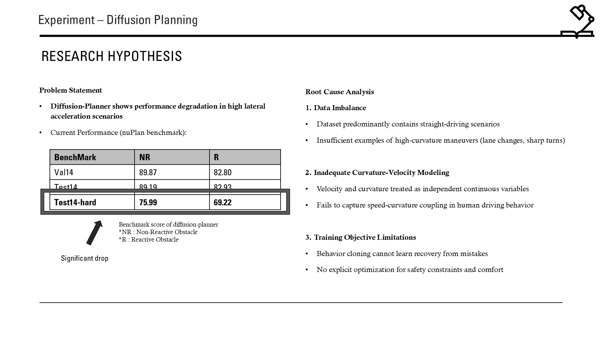

**Section 3: Proposed Solutions**

We propose four complementary approaches to address the identified problems:

1. Data Reweighting (In Progress) — Increase sample weights for curve driving and lane change scenarios to counteract dataset imbalance, targeting improved lateral acceleration handling at high speeds.
2. Velocity Discretization (In Progress) — Replace raw continuous velocity-curvature variables with a coupled discretization scheme. Data is split into three categories: accurate (low-speed, precise control), accurate + sampling (mid-speed, balanced), and sampling (high-speed, diverse patterns).
3. GRPO Fine-Tuning — Apply DeepSeek's RL-based fine-tuning method with stage-wise learning: path following → speed control → safety enhancement. This moves beyond behavior cloning to directly optimize planning quality.
4. Curvature-Velocity Coupling Enhancement — Explicitly model the curvature-velocity joint distribution in the diffusion conditioning, enabling the model to learn automatic deceleration at high curvature.

=== "Slide 6"
    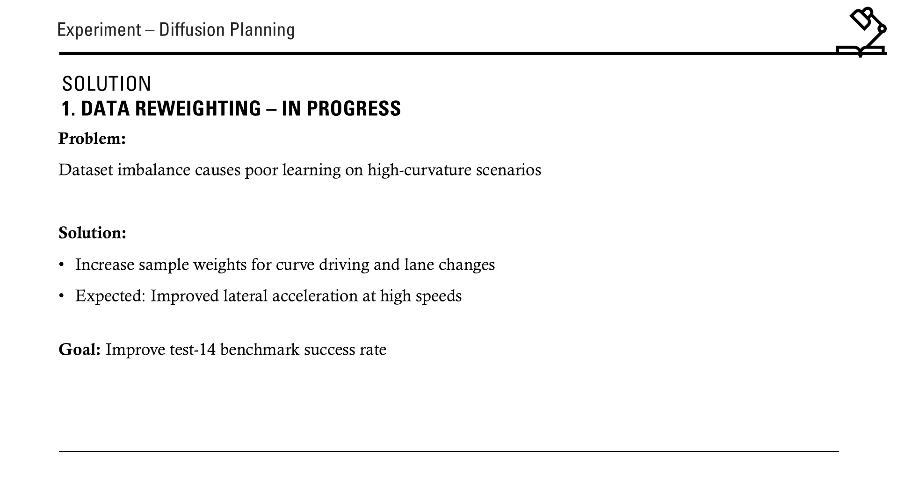

=== "Slide 7"
    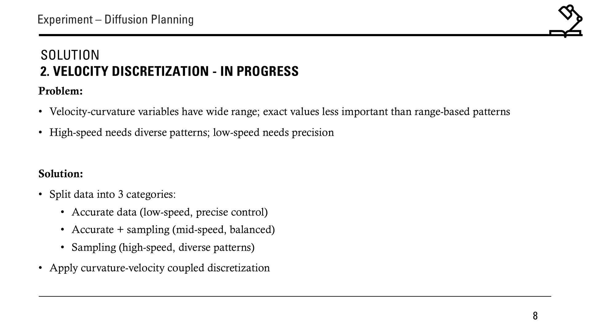

=== "Slide 8"
    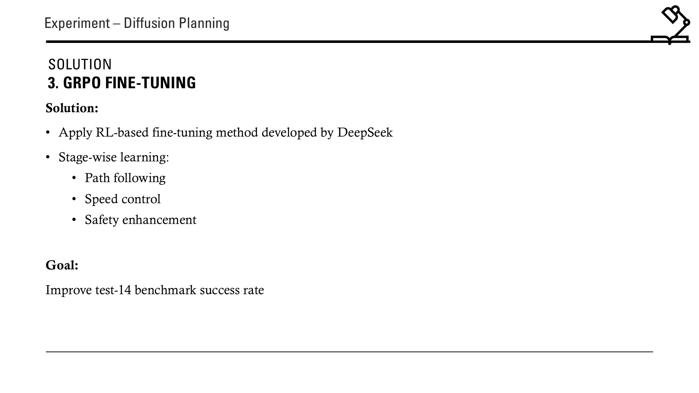

=== "Slide 9"
    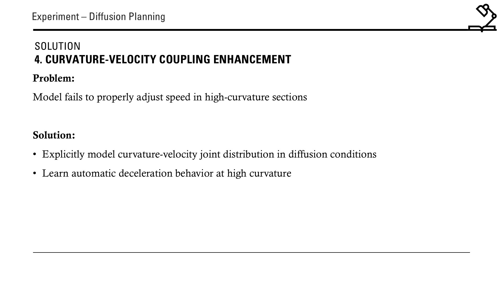

**Section 4: Final Goal**

The target is threefold. First, enhance model output from position-heading trajectory (x, y, θ) to velocity-integrated trajectory (x, y, θ, v), enabling explicit speed control along the planned path. Second, achieve ≥71.22 on nuPlan Test14-hard Reactive mode — a +2.0 point improvement over the 69.22 baseline. Third, focus validation on reactive obstacle avoidance and high lateral acceleration maneuvers to confirm curvature-velocity coupling effectiveness.

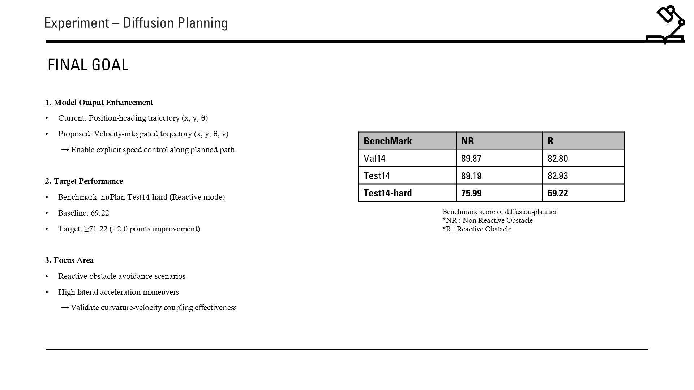

**Section 5: Engineering — Autoware E2E Integration**

On the engineering side, we are developing an Autoware-based package for High-Level Command (HLC) generation using a hybrid Rule-Based + E2E methodology. Active communication with the Autoware developer community has been maintained, though delayed due to CES resource constraints and intensive focus on platform integration with the Alpamayo release. Near-term tasks include retraining based on GenAD, quantifying DL4AGX deployment improvements with TensorRT, and if integration succeeds, researching FPS optimization (>10 FPS) and data collection pipelines.

=== "Slide 11"
    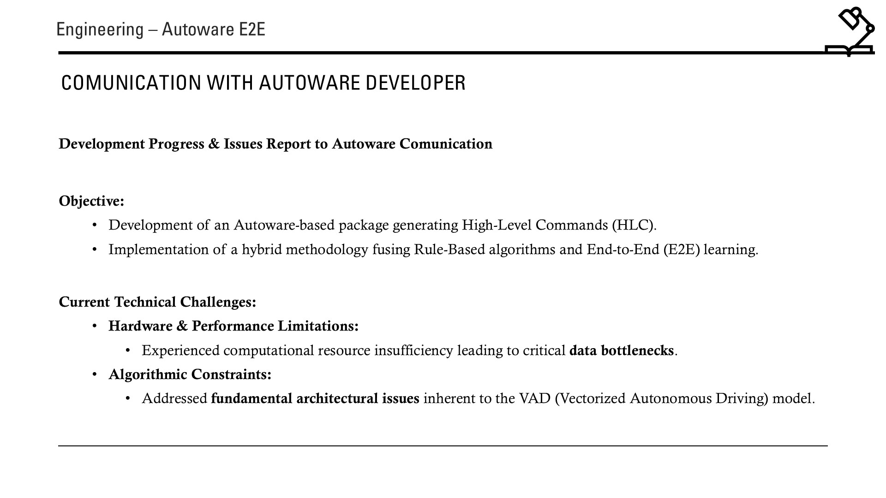

=== "Slide 12"
    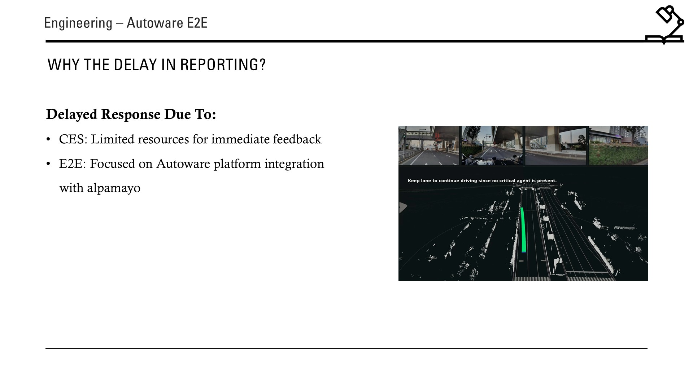

=== "Slide 13"
    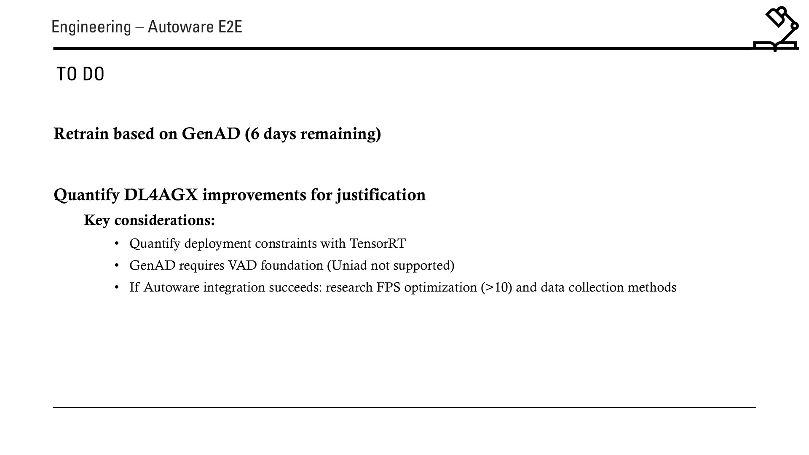
