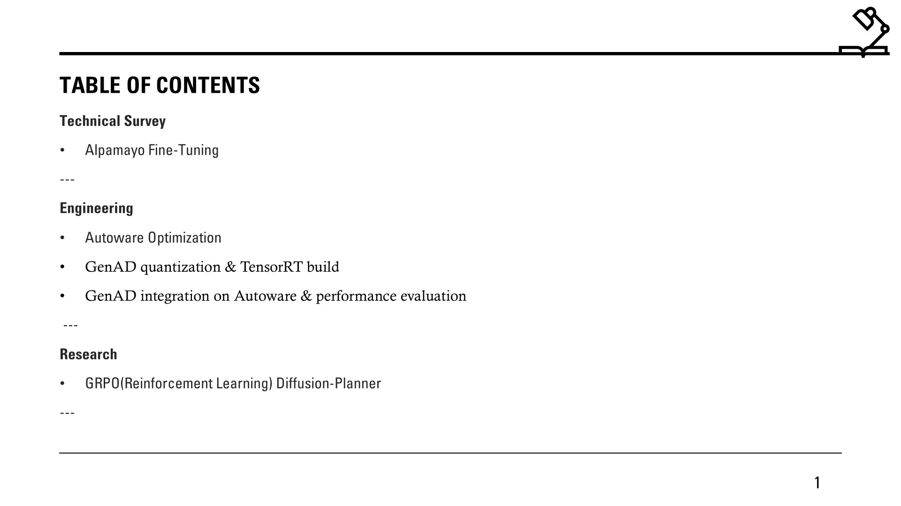
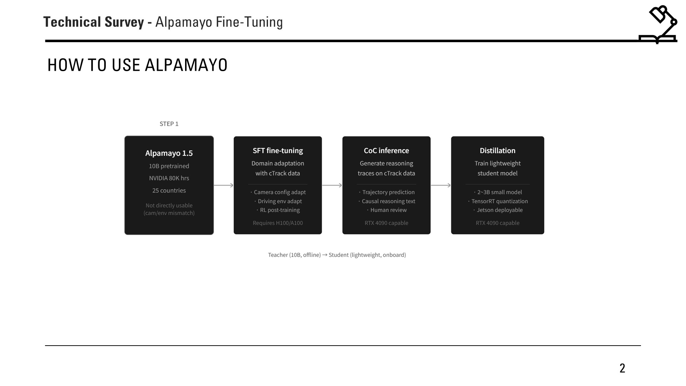
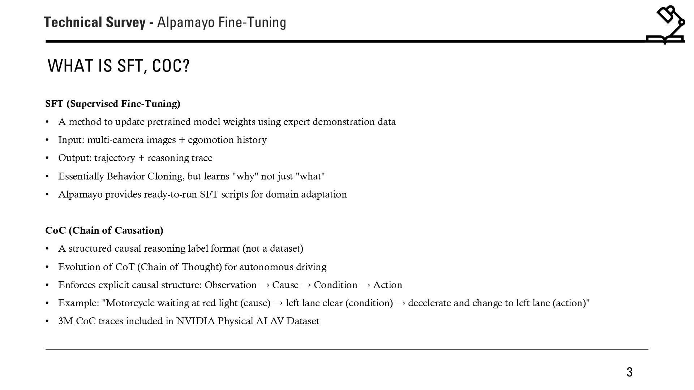
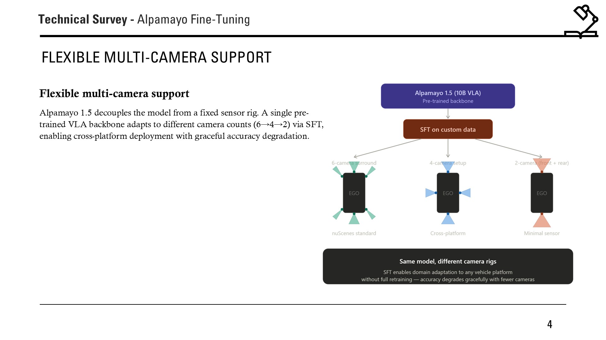
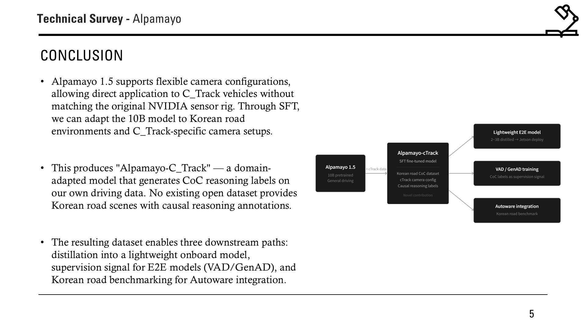
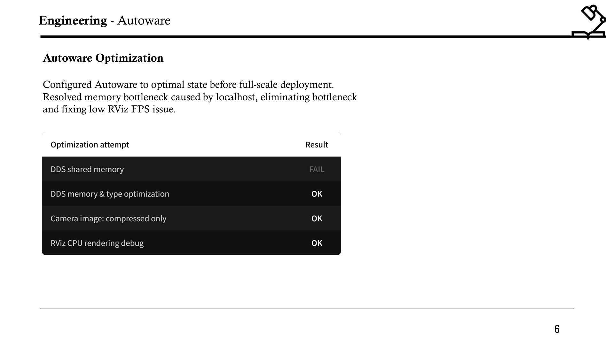
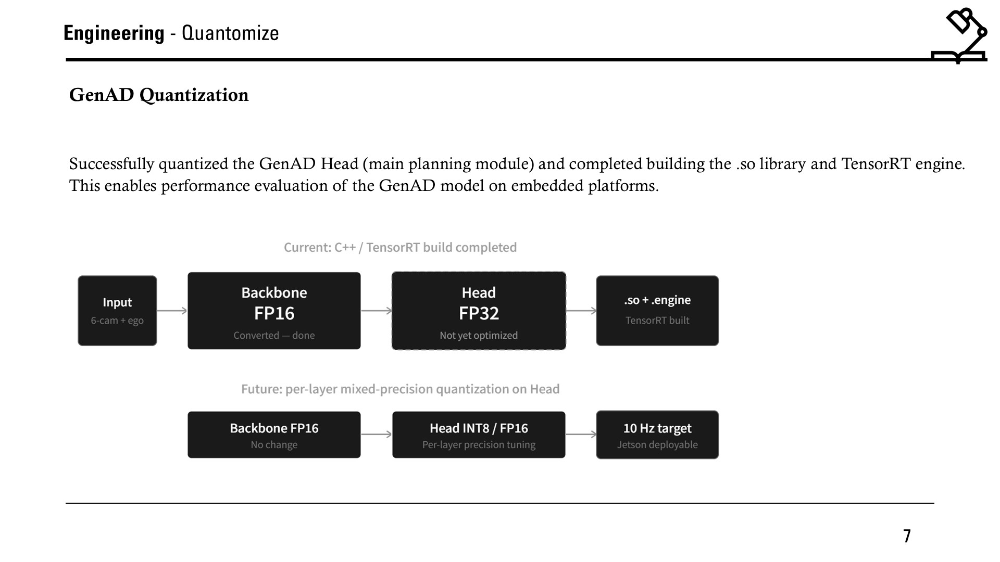
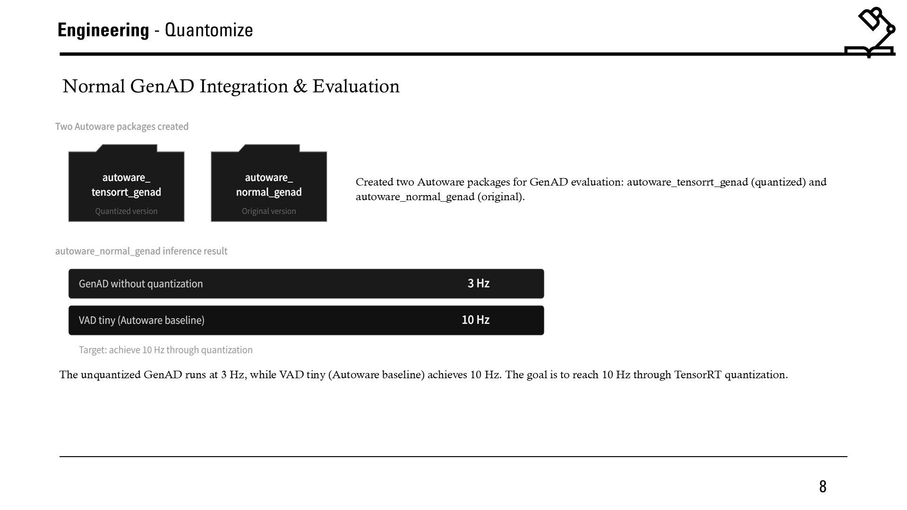
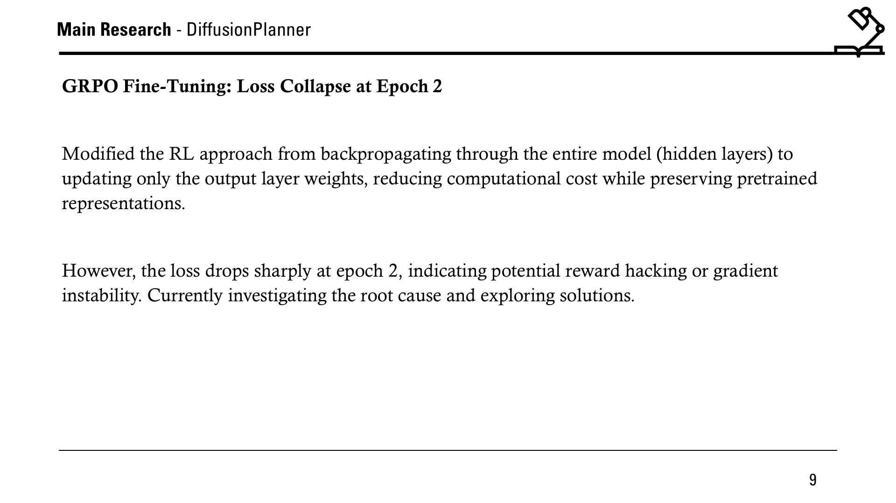

>## **2026.04.03 | Academic Seminar**

E2E with Diffusion Model Planning

### **Full Presentation**

<iframe src="https://view.officeapps.live.com/op/embed.aspx?src=https://ysh-research.github.io/Presentations/assets/2026-04-03/2026.04.03.pptx" width="750px" height="470px" frameborder="0"></iframe>

### **Introduction**

Title: Alpamayo Fine-Tuning, Autoware Optimization & GRPO Research

This seminar covers three tracks: a technical survey on Alpamayo fine-tuning with SFT and CoC for domain adaptation to C-Track, engineering progress on Autoware optimization and GenAD quantization with TensorRT, and ongoing GRPO fine-tuning research addressing loss collapse in Diffusion-Planner.

**Section 1: Alpamayo Fine-Tuning**

Alpamayo 1.5 (10B pretrained) cannot be directly used due to camera/environment mismatch. The pipeline is: SFT fine-tuning with C-Track data for domain adaptation, CoC (Chain of Causation) inference to generate reasoning traces, then distillation into a lightweight 2-3B student model deployable on Jetson via TensorRT. SFT updates pretrained weights using expert demonstration data, while CoC enforces explicit causal structure (Observation to Cause to Condition to Action). Alpamayo 1.5 also supports flexible multi-camera configurations (6 to 4 to 2 cameras) via SFT, enabling cross-platform deployment with graceful accuracy degradation. The result is "Alpamayo-C_Track" — a domain-adapted model generating CoC reasoning labels on Korean road data, enabling distillation, E2E model supervision, and Autoware benchmarking.

=== "Slide 3"
    

=== "Slide 4"
    

=== "Slide 5"
    

=== "Slide 6"
    

**Section 2: Autoware Optimization**

Configured Autoware to optimal state before full-scale deployment. Resolved memory bottleneck caused by localhost, eliminating bottleneck and fixing low RViz FPS issue. DDS shared memory failed, but DDS memory & type optimization, camera image compressed-only transport, and RViz CPU rendering debug all succeeded.

**Section 3: GenAD Quantization & Integration**

Successfully quantized the GenAD Head (main planning module) and completed building the .so library and TensorRT engine. Current state: Backbone FP16 (converted), Head FP32 (not yet optimized). Future plan: per-layer mixed-precision quantization on Head (INT8/FP16) targeting 10 Hz on Jetson. Two Autoware packages created for evaluation: autoware_tensorrt_genad (quantized) and autoware_normal_genad (original). Unquantized GenAD runs at 3 Hz vs. VAD tiny baseline at 10 Hz — the target is to reach 10 Hz through TensorRT quantization.

=== "Slide 8"
    

=== "Slide 9"
    

**Section 4: GRPO Diffusion-Planner**

Modified the RL approach from backpropagating through the entire model (hidden layers) to updating only the output layer weights, reducing computational cost while preserving pretrained representations. However, the loss drops sharply at epoch 2, indicating potential reward hacking or gradient instability. Currently investigating the root cause and exploring solutions.

