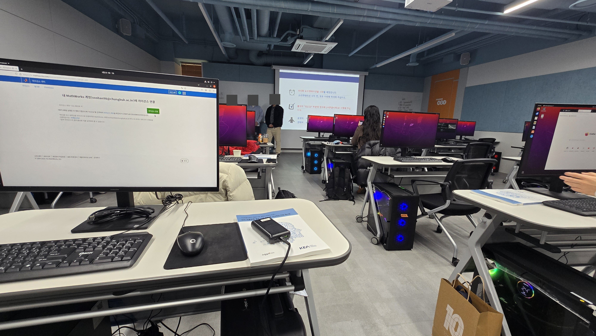

# How to E2E Evaluation in Carla Simulation with Bench2Drive & Roadrunner

**Date:** 2026.02.23~25 /
**Speaker:** Prof. Kichun Jo /
**Organization:** Hanyang Univ. /
**Category:** E2E, Carla

---

## Introduction

Learned about the latest trends in E2E autonomous driving, and how to create scenarios using Roadrunner, Scenariorunner, and OpenDrive for Bench2Drive. Also covered running scenarios in CARLA simulation and adding a new "speed violation" evaluation metric to Bench2Drive.

{ width="600" }

---

## Main Content

### Topic 1
<!-- 내용 + 사진 -->

{ width="600" }

### Topic 2

{ width="600" }

### Topic 3

{ width="600" }

---

## Review

