# 발표 제목

> 2026.01.29 | Academic Seminar

---

## Full Presentation

<iframe src="https://view.officeapps.live.com/op/embed.aspx?src=https://yoursite.github.io/my-ros-note/Presentations/assets/2026-01-29/2026.01.29.pptx" width="100%" height="500px" frameborder="0"></iframe>

📥 [Download PPT](assets/2026-01-29/2026.01.29.pptx)

---

## Introduction

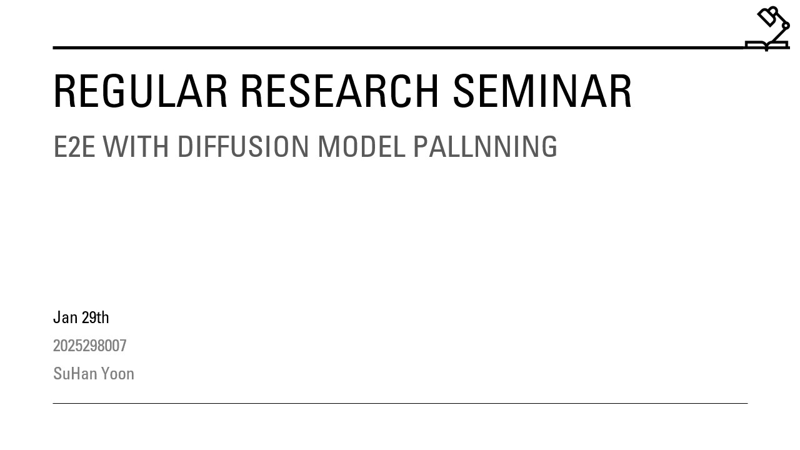

서론 설명...

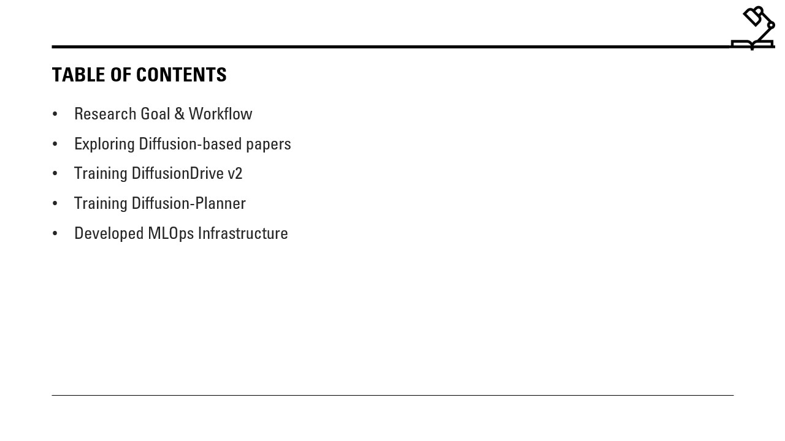

설명...

---

## Key Contents

### Section 1

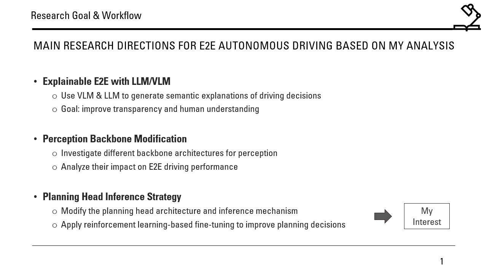

설명...

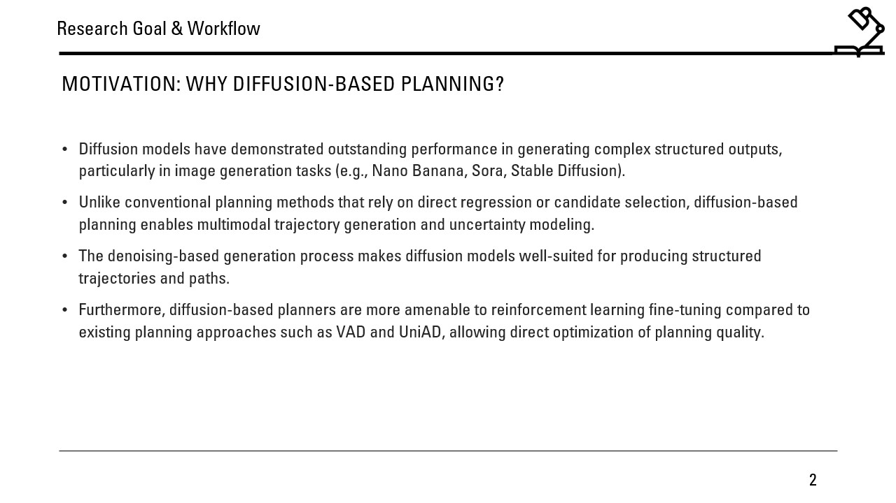

설명...

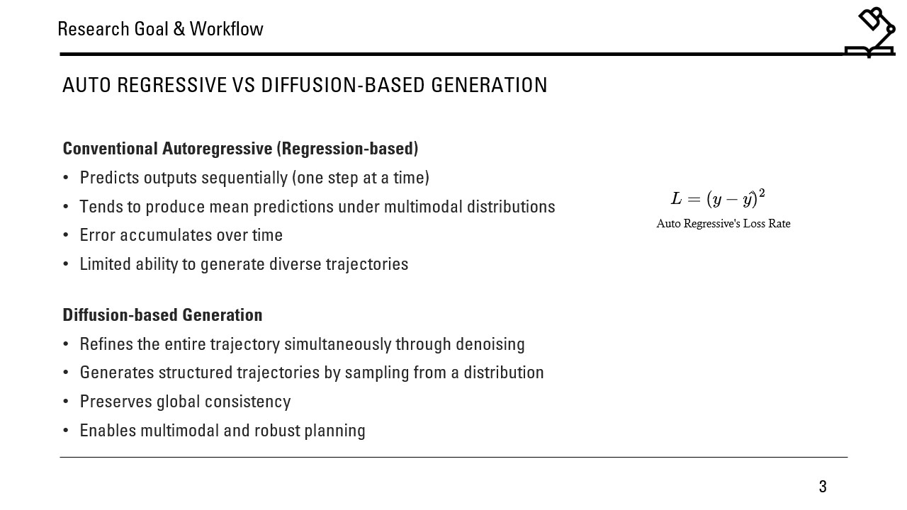

설명...

### Section 2

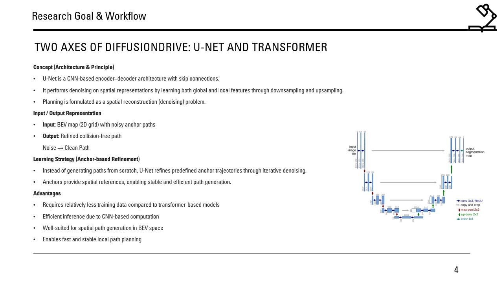

설명...

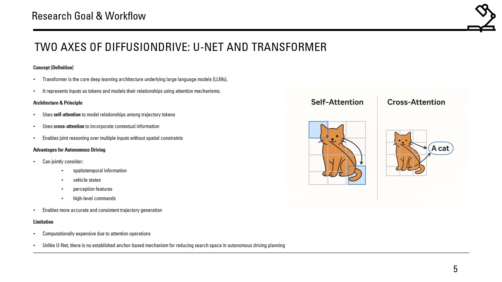

설명...

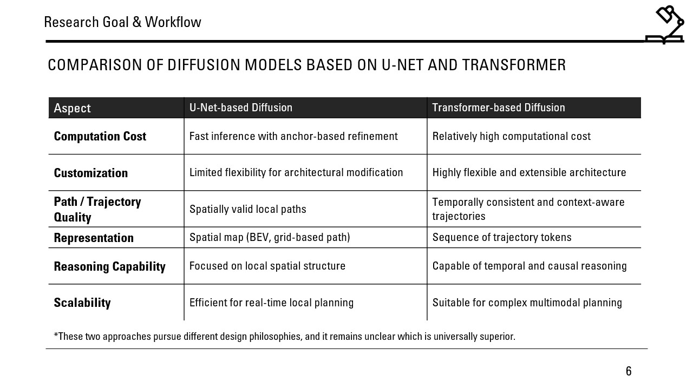

설명...

### Section 3

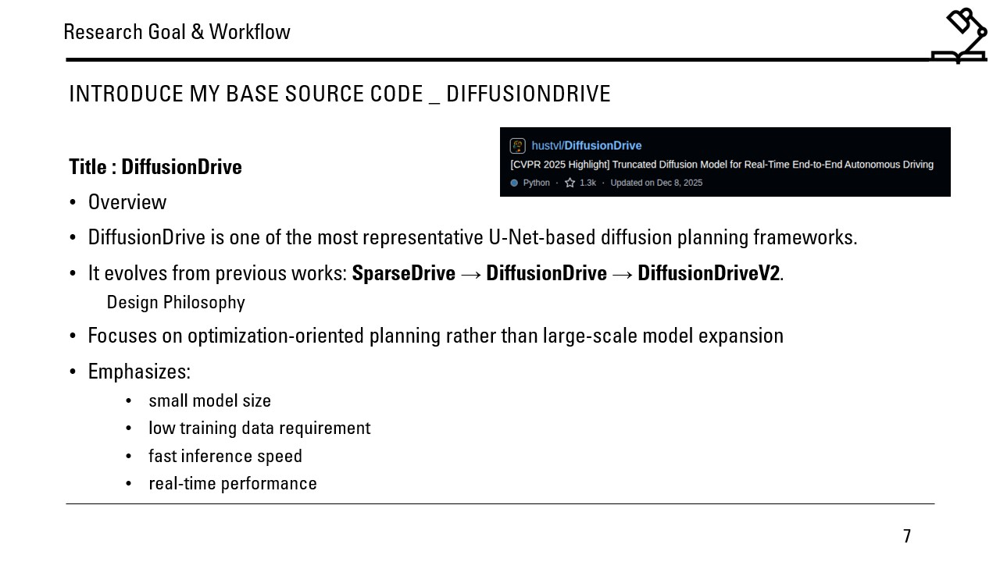

설명...

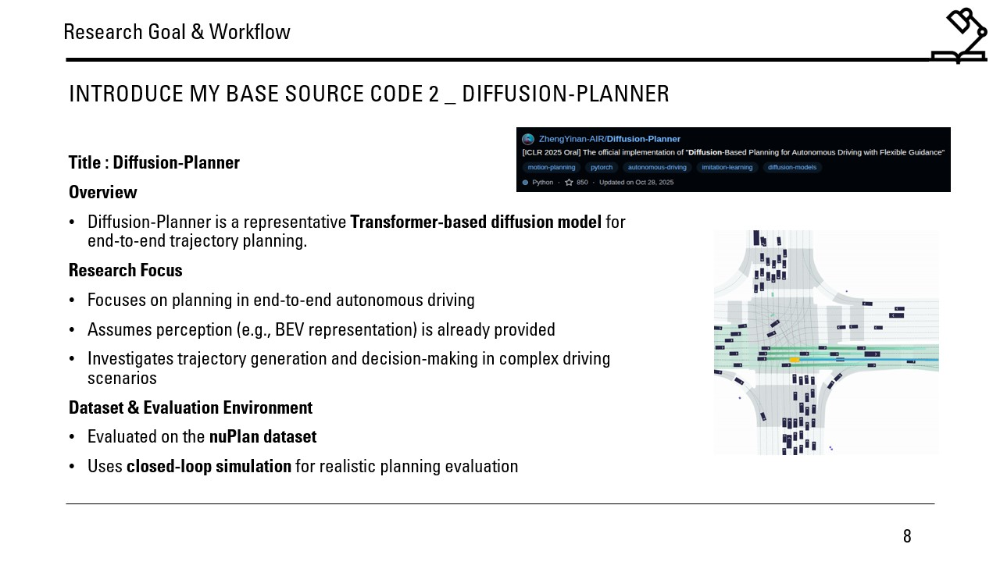

설명...

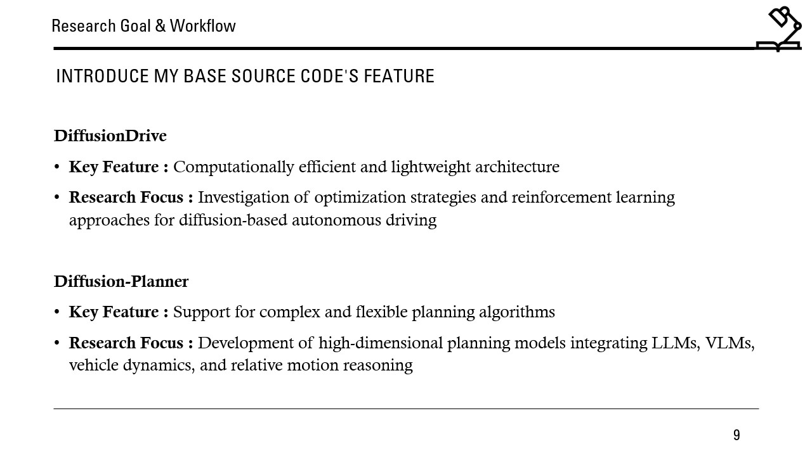

설명...

### Section 4

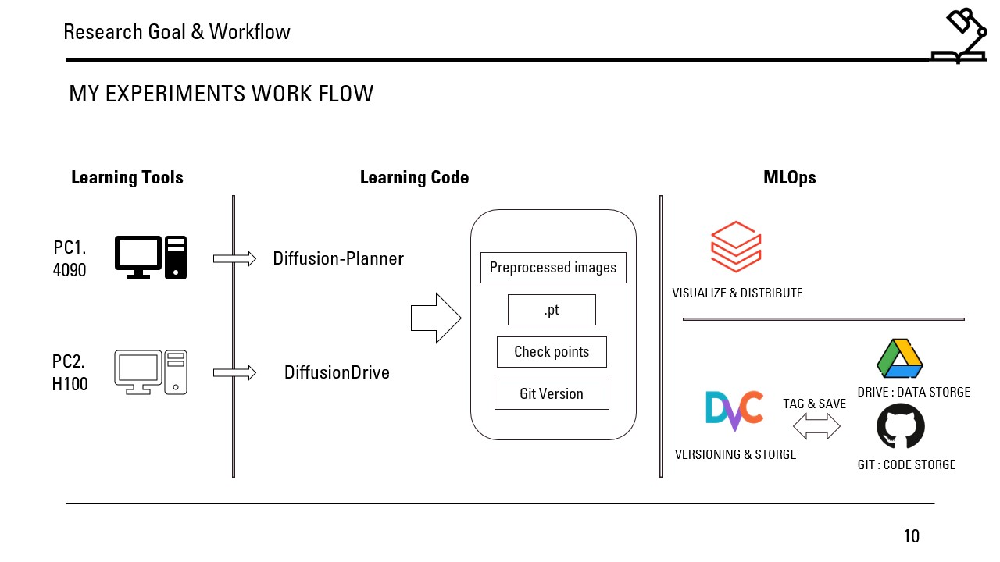

설명...

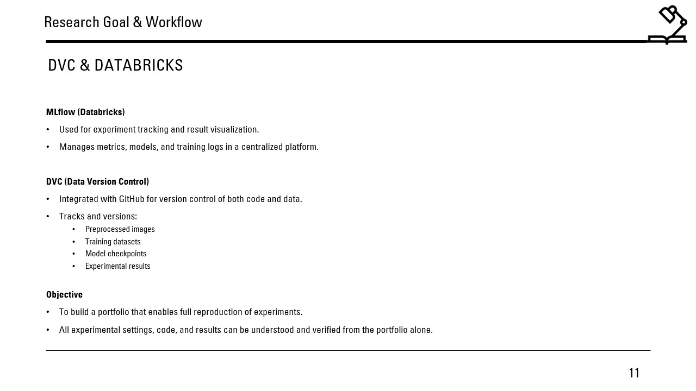

설명...

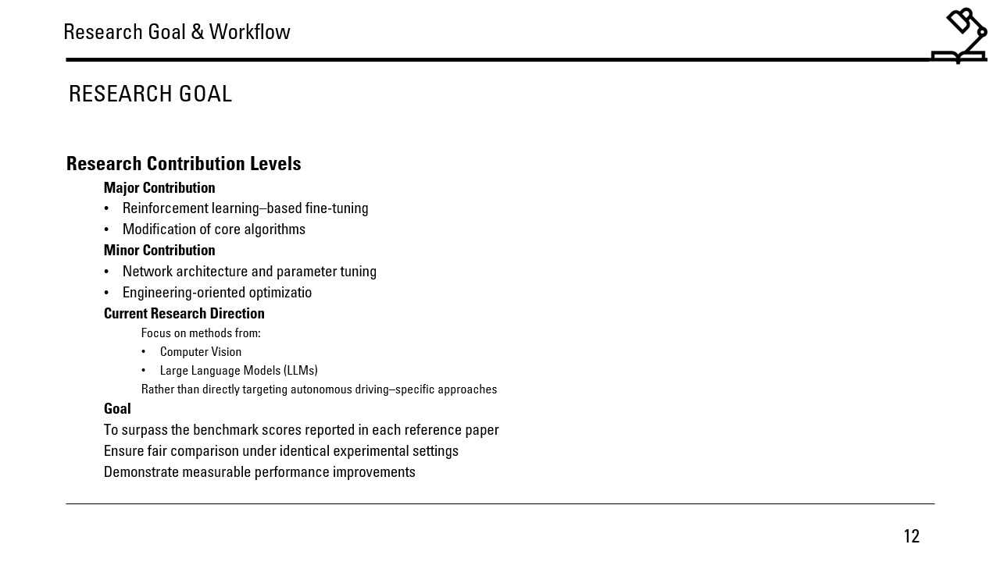

설명...

---

## Conclusion

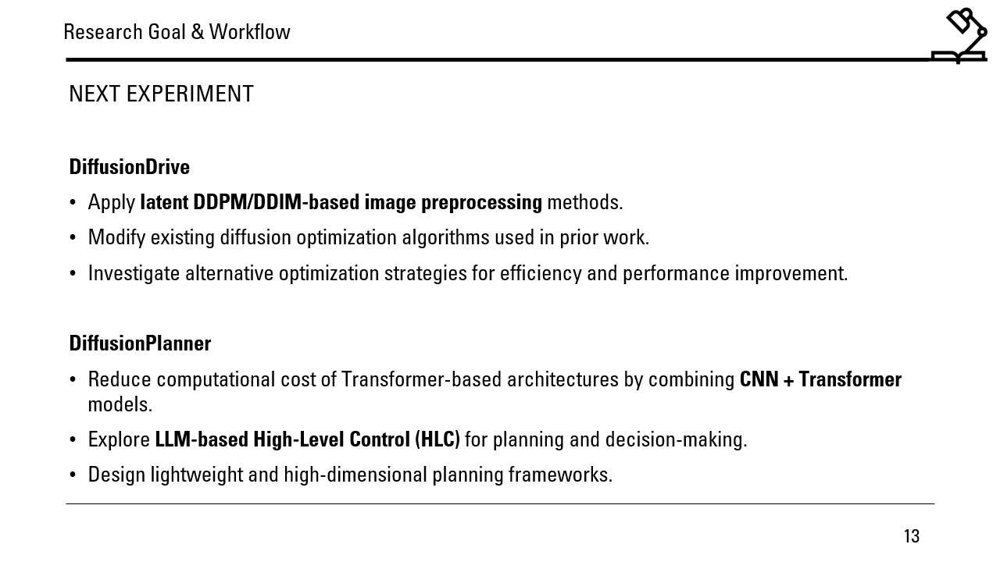

결론 설명...
